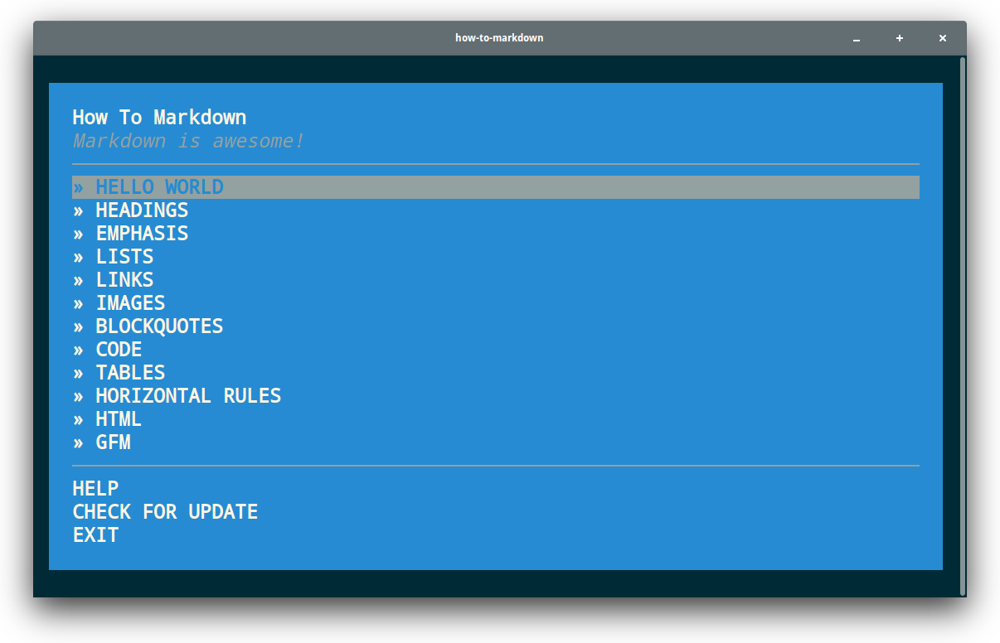

# how-to-markdown

[![NPM version][npm-image]][npm-url]
[![node][node-image]][node-url]
[![Dependency Status][depstat-image]][depstat-url]
[![Build Status][buildstat-image]][buildstat-url]

> Learn how to start using Markdown.

It's kinda strange, but many people still don't know Markdown, although there is nothing hard about this amazing tool. This workshopper will teach you how to use Markdown.

> **Markdown** is a _lightweight markup language_ with plain text formatting syntax designed so that it can be converted to [HTML] and many other formats using a tool by the same name.
>
> — about [Markdown] at **Wikipedia**

## Exercises

This workshopper has 12 easy and clear tasks that cover the most important aspects of Markdown.

* **HELLO WORLD** — the brief history of Markdown.
* **HEADINGS** — how to use headings.
* **EMPHASIS** — how you mark some text as important.
* **LISTS** — creating of ordered and unordered lists.
* **LINKS** — inline and reference links.
* **IMAGES** — how to embed images.
* **BLOCKQUOTES** — how to paste blockquotes.
* **CODE** — inline code and blocks of code with syntax highlighting.
* **TABLES** — creating tables.
* **HORIZONTAL RULES** — how to split information using horizontal rules.
* **HTML** — using HTML in a Markdown document.
* **GFM** — useful things in [GitHub Flavored Markdown](https://guides.github.com/features/mastering-markdown/).

## Requirements

If you are on Windows, make sure you are using at least version 5.1.0 of Node.js, which provides a fix for a bug in Windows where you can't choose items in the menu.

* [**Node.js**](node-url) >=4.0.0 (>=5.1.0 for Windows)

## Installation

Open your terminal and run this command:

    npm install -g how-to-markdown

Use `sudo` if you get an `EACCESS` error.

## Usage

Open your terminal and run the following command:

    how-to-markdown

## License

MIT © [Denys Dovhan](http://denysdovhan.com)

<!-- References -->

[html]: https://en.wikipedia.org/wiki/HTML
[markdown]: https://en.wikipedia.org/wiki/Markdown

<!-- Badges -->

[npm-url]: https://npmjs.org/package/how-to-markdown
[npm-image]: https://img.shields.io/npm/v/how-to-markdown.svg?style=flat-square

[node-url]: https://nodejs.org/en/download/
[node-image]: https://img.shields.io/node/v/how-to-markdown.svg?style=flat-square

[depstat-url]: https://david-dm.org/workshopper/how-to-markdown
[depstat-image]: https://david-dm.org/workshopper/how-to-markdown.svg?style=flat-square

[buildstat-url]: https://travis-ci.org/workshopper/how-to-markdown
[buildstat-image]: https://img.shields.io/travis/workshopper/how-to-markdown.svg?style=flat-square